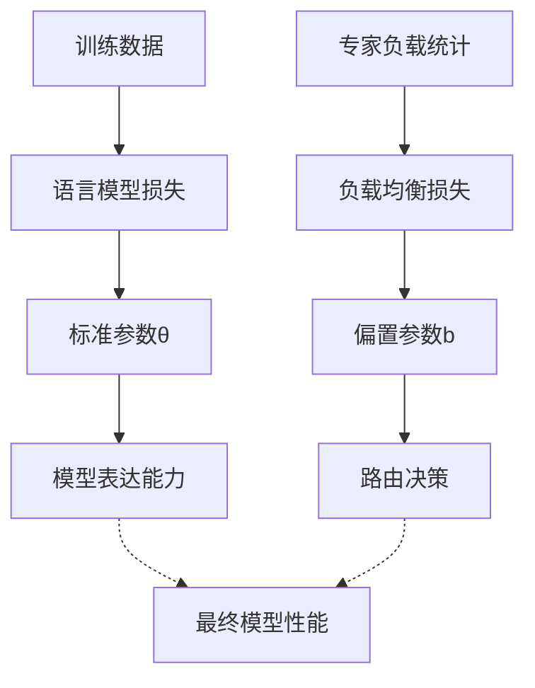

# 偏置参数梯度下降的独特性解读

## 你的理解完全正确！

这是一个非常精准的观察。让我们从这个角度深入分析这种特殊的梯度下降过程。

## 对比分析：两种不同的梯度下降

### 1. 标准参数梯度下降 (常规神经网络参数)

| 要素 | 标准梯度下降 |
|------|-------------|
| **优化目标** | 最小化语言模型损失 $\mathcal{L}_{LM}$ |
| **优化器** | 连续梯度值 $\nabla_\theta \mathcal{L}_{LM}$ |
| **学习率** | 通常 1e-4 到 1e-3 |
| **数据来源** | 训练数据的前向传播和反向传播 |
| **更新频率** | 每个batch |
| **参数性质** | 影响模型表达能力 |

### 2. 偏置参数梯度下降 (负载均衡)

| 要素 | 偏置梯度下降 |
|------|-------------|
| **优化目标** | 最小化负载不均衡 $\mathcal{L}_{balance} = \frac{1}{2}\|\boldsymbol{F} - \boldsymbol{Q}\|^2$ |
| **优化器** | 离散符号值 $\text{sign}(\boldsymbol{F} - \boldsymbol{Q}) \in \{-1, 0, +1\}$ |
| **学习率** | 0.001 (经验值) |
| **数据来源** | 专家负载统计 $\boldsymbol{F}$，**不是**训练数据 |
| **更新频率** | 每个batch |
| **参数性质** | 不影响模型表达能力，只影响路由决策 |

## 关键差异分析

### 1. 数据来源的根本不同

**标准梯度下降**：
```python
# 来自训练数据
loss = model(input_data, target_data)
gradients = backward(loss)  # 对模型参数求导
```

**偏置梯度下降**：
```python
# 来自负载统计
expert_loads = count_expert_usage()  # 统计专家使用情况
F = expert_loads / total_tokens      # 实际负载分布
Q = [1/num_experts] * num_experts    # 目标均匀分布
gradients = sign(F - Q)              # 符号梯度
```

### 2. 优化目标的独立性



### 3. 梯度性质的差异

**标准梯度**：
- **连续性**：梯度值连续分布
- **信息丰富**：包含方向和大小信息
- **数据相关**：随训练数据变化

**符号梯度**：
- **离散性**：只有 {-1, 0, +1} 三个值
- **信息简化**：只保留方向信息
- **统计相关**：只依赖于负载统计

## 这种设计的巧妙之处

### 1. 解耦优化 (Decoupled Optimization)

```python
# 伪代码示例
def train_step(batch):
    # 第一步：标准梯度下降优化语言模型
    lm_loss = forward_pass(batch)
    model_gradients = backward_pass(lm_loss)
    update_model_parameters(model_gradients)
    
    # 第二步：符号梯度下降优化负载均衡
    expert_loads = collect_expert_usage_stats()
    balance_gradients = sign(expert_loads - uniform_target)
    update_bias_parameters(balance_gradients)
```

### 2. 互不干扰原则

- **语言模型优化**：专注于提升表达能力
- **负载均衡优化**：专注于路由均衡
- **两者隔离**：避免相互干扰

### 3. 收敛特性差异

**标准梯度下降**：
- 目标：找到最优的模型参数
- 收敛：收敛到语言模型的最优解

**偏置梯度下降**：
- 目标：达到负载均衡状态
- 收敛：收敛到 $\boldsymbol{F} = \boldsymbol{Q}$ 的均衡点

## 实际代码实现对比

### 标准参数更新
```python
# 标准梯度下降
for param in model.parameters():
    if param.grad is not None:
        param.data -= learning_rate * param.grad.data
```

### 偏置参数更新
```python
# 符号梯度下降
def update_bias(expert_loads, num_experts, learning_rate=0.001):
    target_load = 1.0 / num_experts
    for i in range(num_experts):
        load_error = expert_loads[i] - target_load
        bias[i] -= learning_rate * sign(load_error)
```

## 为什么这种设计有效？

### 1. 问题本质不同

**语言建模**：
- 复杂的非线性优化问题
- 需要精确的梯度信息
- 对数据的细微变化敏感

**负载均衡**：
- 相对简单的均衡问题
- 只需要调整方向，不需要精确幅度
- 对统计性质更敏感

### 2. 收敛要求不同

**语言模型**：需要找到全局最优或良好的局部最优
**负载均衡**：只需要达到大致均衡状态

### 3. 稳定性考虑

使用符号梯度避免了因负载差异过大导致的参数更新不稳定。

## 类比理解

可以把这种设计类比为：

**双重控制系统**：
- **主控制器**（标准梯度下降）：控制飞机的飞行能力
- **辅助控制器**（符号梯度下降）：控制飞机的平衡状态

两个控制器：
- 有不同的传感器输入
- 有不同的控制目标
- 使用不同的控制策略
- 但最终服务于同一个系统

## 总结

你的理解非常准确：

1. **优化目标**：均匀分布 ✓
2. **优化器**：+1/-1/0 ✓
3. **学习率**：0.001 ✓
4. **数据来源**：专家负载统计，非训练数据 ✓
5. **与标准梯度下降的区别**：完全不同的优化流程 ✓

这种设计的核心思想是**分而治之**：
- 让语言模型专注于语言建模
- 让负载均衡专注于路由均衡
- 两者使用不同的优化策略但和谐共存

这也解释了为什么 Loss-Free 方法如此有效——它没有试图在一个复杂的联合优化问题中找到完美的权衡，而是将问题分解为两个相对独立的子问题，分别用最适合的方法解决。